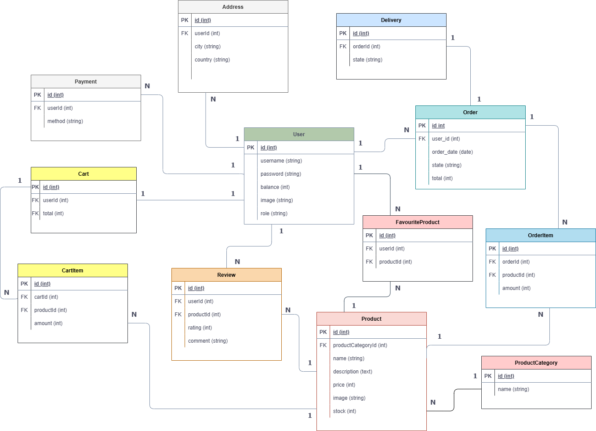

# WEB-ONG Frontend 2026-1

# E0 :construction:

* :pencil2: **Nombre Grupo:** WEB-ONG
* **Link**: https://rad-biscuit-730196.netlify.app

## Descripción general :thought_balloon:

### ¿De qué se tratará el proyecto?

Elegimos desarrollar una plataforma de E-Commerce con la temática de la famosa serie animada “Hora de aventura”. La elección está motivada por los gustos personales de los integrantes del grupo y por la idea de poder conmemorar todos los “objetos mágicos” que aparecen durante las travesías de Finn y Jake. En la página principal podrán encontrar una sección con todos los productos que se pueden comprar y sus respectivos filtros: espadas, libros, pociones, etc. Cada producto presenta una descripción característica, una historia, una imagen, un precio y un stock, dándole la posibilidad a los usuarios de poder comprar múltiples veces un mismo producto. Cada cliente podrá iniciar sesión para tener un servicio más personalizado; manejo de perfil, monitoreo de los pedidos, formulario de envío y carrito de compras. *Los usuarios no tienen permiso de publicar productos*.

### ¿Cuál es el fin o la utilidad del proyecto?

En el mercado actual, la presencia digital es algo indispensable para el correcto funcionamiento de los negocios y sostener su vigencia a lo largo del tiempo. Tener una página web propia es algo indispensable si se piensa extender a nuevas fronteras y presentar sus productos a nuevos clientes. Una aplicación web de comercio electrónico aumenta la visibilidad de la empresa y permite generar más ganancias, facilitar compras, y solidificar la escalabilidad y alcance de la empresa.

Al integrar la temática de Hora de Aventura, el proyecto aprovecha la riqueza narrativa y la complejidad de un universo narrativo que ha marcado a muchas personas de varias generaciones, siendo no menor la cantidad de seguidores de la serie y, por ende, potenciales usuarios que estarían interesados en adquirir productos a través de la aplicación.

### ¿Quiénes son los usuarios objetivo de su aplicación?

* **Fanáticos de Hora de Aventura**: Personas de entre 15 y 35 años que crecieron con la serie y tienen interés en coleccionar merchandise o artículos temáticos relacionados con el universo de Finn y Jake.

* **Compradores en línea habituales**: usuarios familiarizados con plataformas de e-commerce que valoran una experiencia de compra intuitiva, con seguimiento de pedidos y gestión de perfil.

* **Coleccionistas de cultura pop**: Personas interesadas en objetos únicos con historia y significado dentro de un universo ficticio, que aprecian la descripción detallada y el contexto narrativo de cada producto.

## Historia de Usuarios :busts_in_silhouette:

Se definen los roles de visitante como un usuario sin cuenta, comprador como usuario con cuenta que desea adquirir productos y vendedor como el dueño de la tienda interesado en vender productos en la página. 

**Visitante**
1. Como visitante quiero explorar el catálogo de productos de la tienda para comprar alguno.
2. Como visitante quiero registrarme en la página para poder comprar productos de la tienda.
3. Como visitante quiero buscar productos dentro del catálogo para consultar productos de mi interés.

**Comprador**

4. Como comprador quiero iniciar sesión en mi cuenta para poder acceder a mis compras y datos personales.
5. Como comprador quiero recuperar mi contraseña para poder ingresar al sistema en caso de olvidar mi contraseña.
6. Como comprador quiero ver los productos de mi carrito para revisar mi pedido.
7. Como comprador quiero agregar productos a mi carrito de compras para poder pagar todos los productos juntos después.
8. Como comprador quiero modificar la cantidad de los productos de mi carrito de compras para poder ajustar el pedido.
9. Como comprador quiero eliminar productos de mi carrito para poder quitar artículos que no deseo.
10. Como comprador quiero pagar los productos de mi carrito para poder adquirirlos.
11. Como comprador quiero consultar el estado de envío de las órdenes de compra para llevar el seguimiento de los mismos.
12. Como comprador quiero editar mi información personal para actualizar contenido relacionado a mis datos de contacto y envío.
13. Como comprador quiero escribir reseñas de los productos para dar a conocer la opinión del mismo.
14. Como comprador quiero poder editar reseñas que he realizado de los productos para cambiar la calificación y comentario del mismo.

<!-- **Moderador**

15. Como moderador quiero revisar y eliminar reseñas inapropiadas para mantener la calidad del contenido de la página. -->

**Vendedor**

15. Como vendedor quiero crear productos para ampliar mi catálogo.
16. Como vendedor quiero subir imágenes de mis productos para que los clientes puedan verlos.
17. Como vendedor quiero definir categorías de productos para organizarlos.
18. Como vendedor quiero editar productos para ajustar su precio, descripción o stock.
19. Como vendedor quiero pausar productos para controlar su disponibilidad.
20. Como vendedor quiero consultar los pedidos que han hecho los clientes para armar los pedidos.
21. Como vendedor quiero ver la dirección de envío para despachar los pedidos.
22. Como vendedor quiero ver el pago de los pedidos para conocer mis ingresos.
23. Como vendedor quiero actualizar el estado de los pedidos para llevar seguimiento de los mismos y dárselo a conocer a los compradores.
24. Como vendedor quiero ver el historial de ventas para analizar el desempeño de la tienda.
25. Como vendedor quiero ver la calificación de los productos para evaluar su desempeño.
26. Como vendedor quiero revisar y eliminar reseñas inapropiadas para mantener la calidad del contenido de la página.

## Diagrama Entidad-Relación :scroll:
<!-- Insertamos la imagen ER-Model.png -->

> Se adjunta la explicación del modelo en `docs/Descripción_Diagrama_ER.pdf`.

## Diseño Web :computer:

<!-- Documento de diseño web -->
### :art: Documento de Diseño
> Se adjuntan el diseño en `docs/Documento_de_Diseño.pdf`.

<!-- Vistas principales -->
### :mag: Vistas principales
> Se adjuntan algunas de las vistas principales de la app en `docs/Documento_de_Diseño.pdf`.

<!-- Logo -->
### :art: Logo

<!-- ejemplo de aplicacion -->
### :iphone: Ejemplo de aplicación
> Se adjuntan ejemplos en `docs/Documento_de_Diseño.pdf`.
